# node-red-contrib-miio-localdevices

[](https://nodered.org)
[](https://nodejs.org/en/)
[](https://github.com/stason325/node-red-contrib-miio-localdevices/blob/master/LICENSE)


[](https://www.npmjs.com/package/node-red-contrib-miio-localdevices)
[](https://packagequality.com/#?package=node-red-contrib-miio-localdevices)


[](https://github.com/stason325/node-red-contrib-miio-localdevices/issues)


Node for Node-Red to control Mi Devices locally via node-mihome (Humidifiers, Purifiers, Heaters, Fans, Vacuums, Lights - list of devices to be enlarged).

## References

Based on `node-mihome` library: <https://github.com/maxinminax/node-mihome>

## List of supported devices
See [DEVICES.md](DEVICES.md) for full list of supported devices and commands available for them.

Please make sure whether your device is supported by default, or you need to import additional definition file (please inspect carefully column "Import File" in DEVICES table). In case you need to import the file follow the instuctions below (*section "Send command node"* in README).

It is theoretically possible to add support for any wifi-device which is operated via MIIO and MIOT protocols. Thus feel  free to request support of new devices.

## Successfully Tested Devices
- [x] deerma.humidifier.mjjsq
- [x] zhimi.humidifier.cb1
- [x] zhimi.heater.za1
- [x] zhimi.airpurifier.mb4
- [x] philips.light.downlight
- [x] yeelink.light.strip1
- [x] yeelink.light.color3
- [x] viomi.vacuum.v7
- [x] deerma.humidifier.jsq5
- [x] leshow.humidifier.jsq1
## Installation

```sh
npm install node-red-contrib-miio-localdevices
```

## Latest Updates

### version 0.4.7
- 1 more device was tested (leshow.humidifier.jsq1)
- added support for dmaker.airfresh.a1

### version 0.4.6
- 1 more device was tested (deerma.humidifier.jsq5)
- added support for leshow.humidifier.jsq1 and zhimi.toilet.sa1 (both to be tested)

### version 0.4.5
- devices in configuration node are now splitted by device types
- fixed range for color temperature for philips lights
- 1 more device was tested (viomi.vacuum.v7)
- fixed cleaning by rooms with viomi.vacuum.v7
- updated powerOff with deerma.humidifier.mjjsq + now defFile is needed to be copied
- added support for vzhimi.toilet.sa1

### version 0.4.3
- added support for viomi.vacuum.v7 (with clean by rooms)
- 3 more devices were tested (philips.light.downlight, yeelink.light.strip1, yeelink.light.color3)

### version 0.4.2
- zhimi.airpurifier.mb4 fan level command was fixed
- now 15 new Yeelight ceilings, 6 new Yeelight strips and 1 Yeelight bulb are supported

### version 0.4.1
- DEVICES.md was splitted by device types
- now five new Philips Lights are supported: downlight, bulb, hbulb, candle, candle2

### version 0.4.0
- "frendly names" option for JSON with device properties was added in GET-node
- filter for list of commands apllicable for the chosen device was added in SEND-node
- "Node Help" section was added in GET-node and SEND-node
- two more devices were tested (za1, mb4)

### version 0.3.0
- algorithm for sending commands to MIOT devices was updated
- logic behind GET-node was revised: no need to trigger GET-node with input message anymore, in case of auto-polling GET-node sends actual JSON each time properties were changed
- one more device was tested (cb1)

## Description and Setup
### Available nodes:
* MIIOgetdata
* MIIOsencommand
* devices (configuration node)

You can find nodes in `mihome` section.


### Setting Up:
1) Configure your device with configuration node

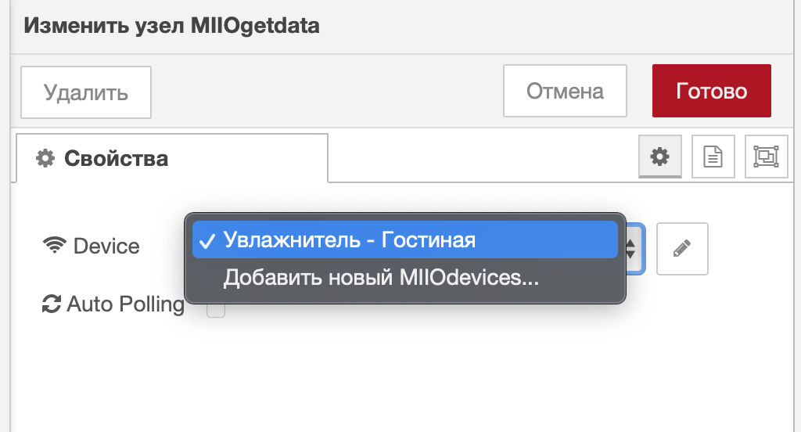
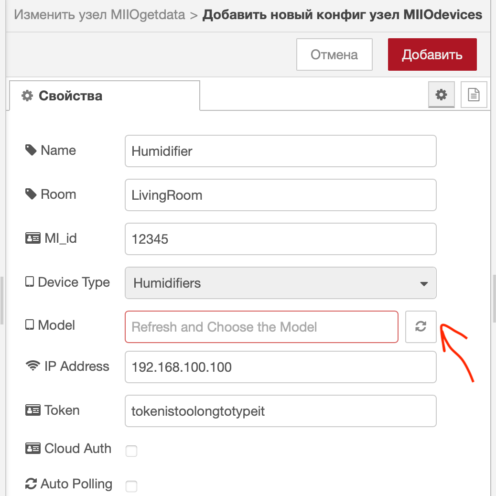
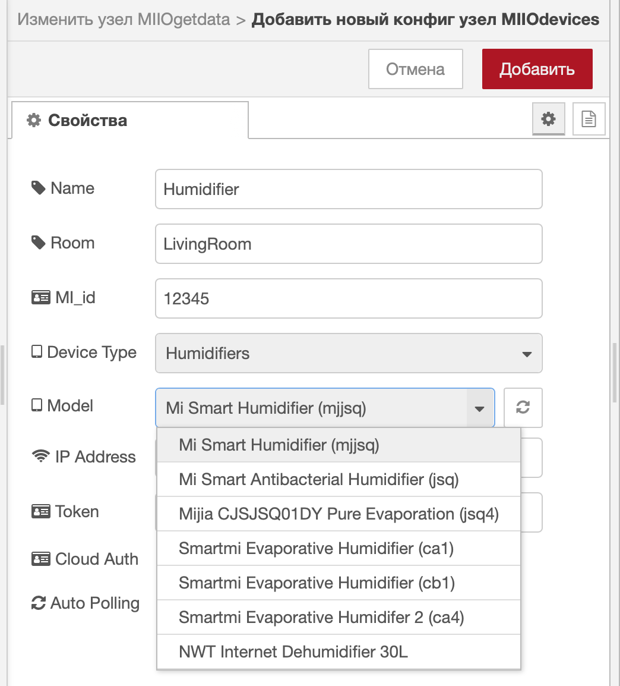

2) For obtaining MiHome tokens please check out this guide:

<https://github.com/Maxmudjon/com.xiaomi-miio/blob/master/docs/obtain_token.md>

3) Starting from 0.4.0 you can choose whether GET-node returns JSON with original Mi-protocol properties' names or "friendly" names

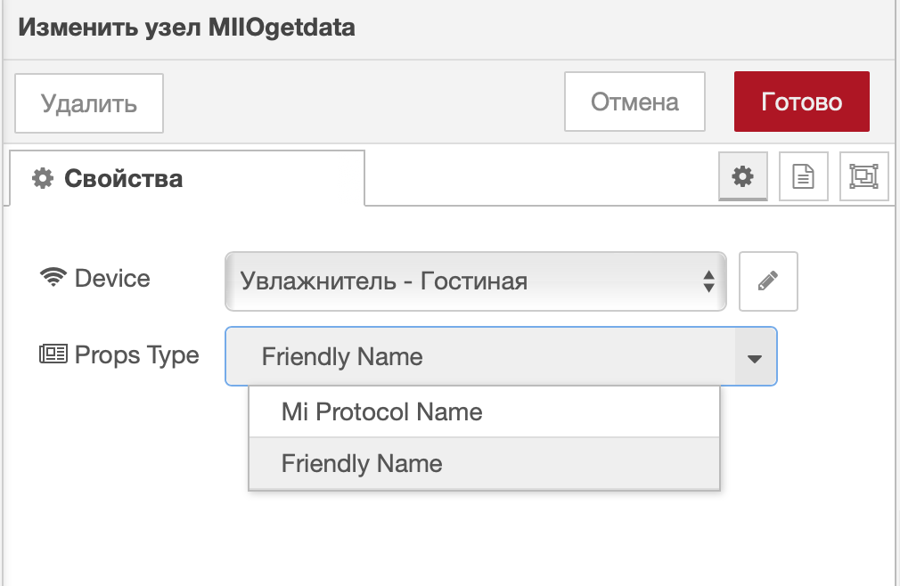

4) Set up Send command nodes in line with pictures and example:

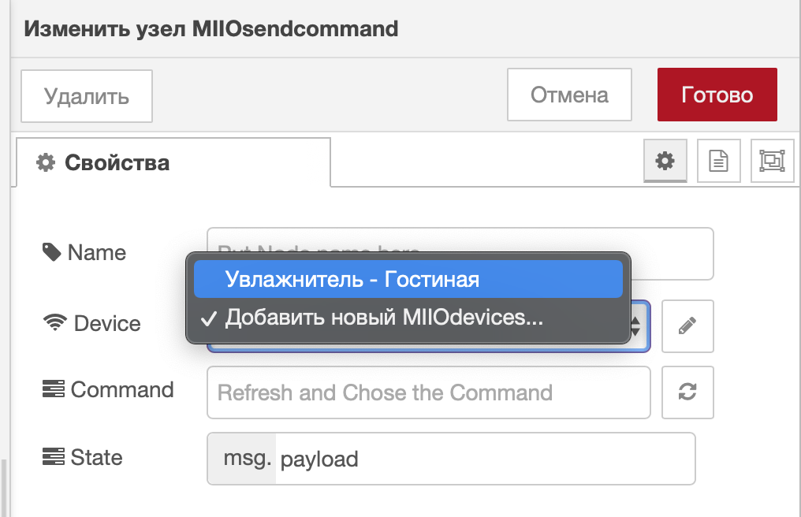
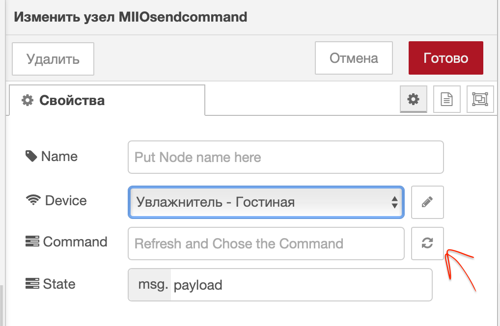
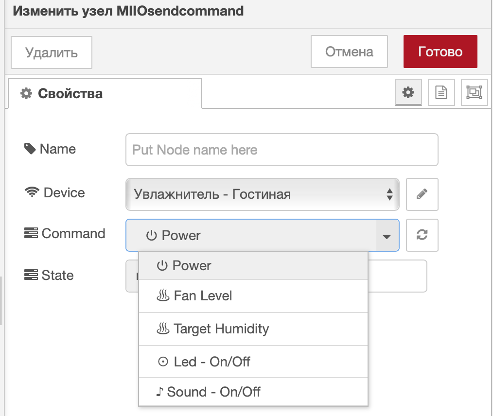

5) Overall flow could look like that (instead of or together with dashboard nodes you can use Alice-nodes, HomeKit-nodes etc.):

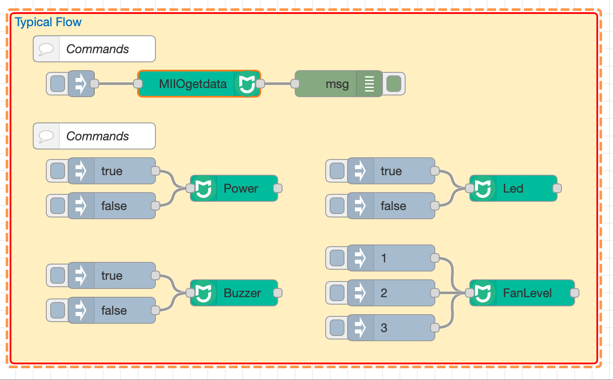

Ta make sure that your flow works properly I would recommend using certain hints (like in [example.json](examples/example.json) attached):
- save data to context and use filter-nodes to prevent looping in your flow
- ~~send input message (timestamp) to GET-notes only after making changes to configuration of your device ... don't overpush GET-node~~ (*depreciated*)
- try not to trigger several SEND-nodes related to the same device at the same time - this can lead to "call to device timed out" error and as a result you will need to reboot Node Red to restore connection with the device


### Device Status Updates and Errors
#### Get node:
1) ~~sending JSON with actual device characteristics is trigered by input message~~ (*depreciated: starting from 0.3.0 there is no input in GET-node, JSON with current device properties is sent automatically after saving device configuration and deploying*)
2) you can poll your device once or continuously with some interval, for that please check the box and choose polling interval in configuration node (*starting from 0.3.0 if auto-polling is turned on, GET-node sends JSON with actual characteristics only if these sharacteristics have changed*)
3) if polling was successful you will see "Connection: OK" or "State: changed" green status under the node and after that get message with actual device characteristics (*starting from 0.4.0 the vocabulary was added and you are free to choose whether GET-node returns JSON with original Mi-protocol properties' names or "friendly" names*)

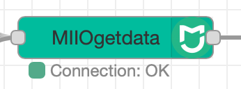


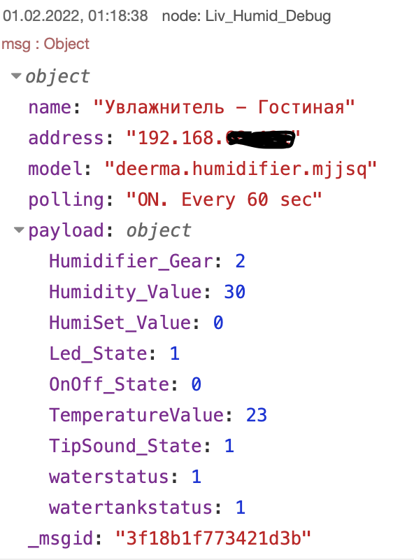

4) some MIOT devices could require authorization in your MiHome account (please see collumn "Cloud Auth" in [DEVICES.md](DEVICES.md)). If you failed to get JSON with device charecteristics without MiHome auth, fill in your MiHome credentials in config node and try to poll the device once again (I hope you will not need it).

#### Send command node:
1) If sending command was successful and device supports your command (please see [DEVICES.md](DEVICES.md)) you will see ok-status under the node.


2) Some devices are not basically included into Node-mihome library but supported through node-red-contrib-miio-localdevices (please see collumn "Import File" in [DEVICES.md](DEVICES.md)). If you have such a device you need to copy-paste additionally the definition-file for your device. Do it this way:

* find file you need in "defFiles" folder here: `~/.node-red/node_modules/node-red-contrib-miio-localdevices/defFiles`  
* copy definition-file you need and paste it to your node-mihome folder: `~/.node-red/node_modules/node-mihome/lib/devices` or `~/.node-red/node_modules/node-red-contrib-miio-localdevices/node_modules/node-mihome/lib/devices` (choose the one that exists)
* reboot Nodered.

#### Errors and Exceptions:
1) in case of errors you will see red status under the node and get message with the nature of error accured.

 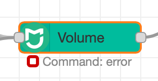

 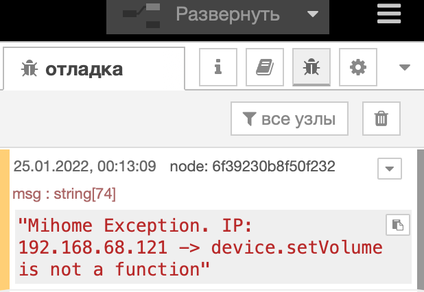

### Flow Example
You can import attached [example.json](examples/example.json) from Node-Red Import menu.
## Future Updates and Improvement
- [x] add auto-polling option with configurable interval
- [x] implement MIOT protocol + add MIOT-humidifiers and purifiers
- [x] make vocabulary with universal frendly names of properties 
- [x] filter the list of commands in SEND-node to those applicable only to the device chosen
- [x] added support for Xiaomi Philips Lights (5 devices as of now) + Yeelight Lights, Strips and Bulbs (22 devices)
- [x] added support for Mi Robot Vacuum-Mop P
- [ ] enlarge the list of devices with those operated via MIIO and MIOT protocols

## Reporting an issue and new devices support requests
Please feel free to report all issues and to request support of new devices.