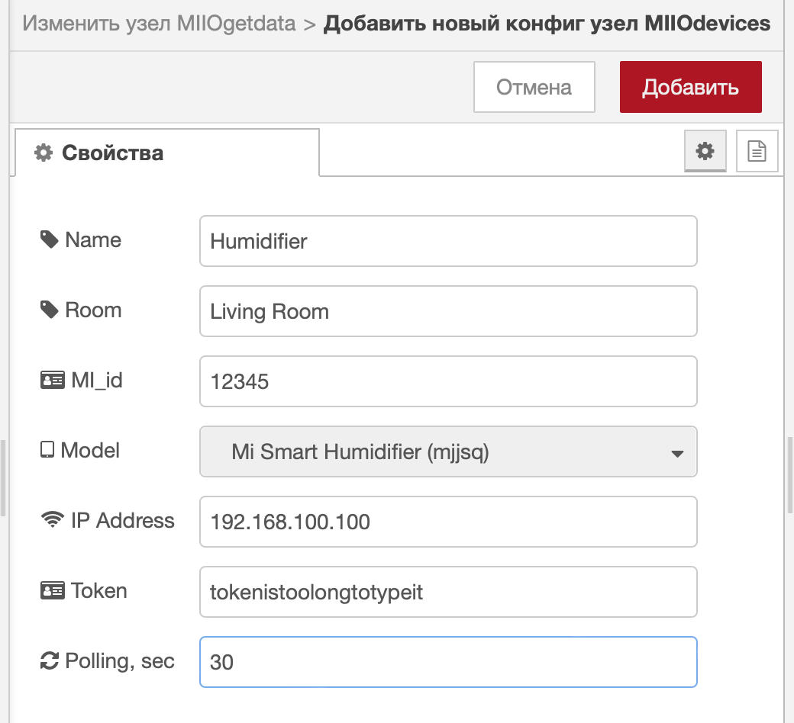

# node-red-contrib-miio-localdevices

[](https://nodered.org)

[](https://github.com/stason325/node-red-contrib-miio-localdevices/blob/master/LICENSE)

Node-Red Nodes for Xiaomi humidifiers and purifiers which can be operated locally via MIIO protocol.

## References

Based on `node-mihome` library: <https://github.com/maxinminax/node-mihome>

Inspired by `@spongioblast`: <https://github.com/spongioblast/node-red-contrib-local-mihome>

## List of supported devices
See [DEVICES.md](DEVICES.md) for full list of supported devices and commands available for them.

## Installation

```sh
npm install node-red-contrib-miio-localdevices
```
## Description and Setup
### Available nodes:
* MIIOgetdata
* MIIOsencommand
* devices (configuration node)

You can find nodes in `mihome` section.


### Setting Up:
1) Configure your device with configuaration node




2) For obtaining MiHome tokens please check out this guide:

<https://github.com/Maxmudjon/com.xiaomi-miio/blob/master/docs/obtain_token.md>

3) Set up controlling nodes in line with pictures and example:


4) Overall flow could look like that (instead of or together with dashboard nodes you can use Alice-nodes, HomeKit-nodes etc.):


Ta make sure that your flow works properly I would recommend using certain hints (like in [example.json](examples/example.json) attached):
- save data to context and use filter-nodes to prevent looping in your flow
- send input message (timestamp) to GET-notes only after making changes to configuration of your device ... don't overpush GET-node
- try not to trigger several SEND-nodes related to the same device at the same time - this can lead to "call to device timed out" error and as a result you will need to reboot Node Red to restore connection with the device


### Errors and Device Status Updates
Get node:
1) sending JSON with actual device characteristics is trigered by input message
2) you can poll your device once or continuously with some interval, for that please check the box and choose polling interval in configuration node
3) if polling was successful you will see ok-status under the node and after that get message with actual device characteristics


4) some MIOT devices could require authorization in your MiHome account (please see collumn "Cloud Auth" in [DEVICES.md](DEVICES.md)). If you failed to get JSON with device charecteristics without MiHome auth, fill in your MiHome credentials in config node and try to poll the device once again (I hope you will not need it).

Send command node:
1) If sending command was successful and device supports your command (please see [DEVICES.md](DEVICES.md)) you will see ok-status under the node.


2) Some devices are not basically included into Node-mihome library but supported through node-red-contrib-miio-localdevices (please see collumn "Import File" in [DEVICES.md](DEVICES.md)). If you have such device you need to download additionally the definition-file for your device. Do it this way:

* go to `Pittini`'s library: <https://github.com/Pittini/iobroker-nodemihome/tree/main/DefinitionfilesForNode-Mihome>
* download definition js-file for your device
* copy it to your Node-Red folder: `~/.node-red/node_modules/node-mihome/lib/devices`
* reboot Nodered.

Errors and Exceptions:
1) in case of errors you will see red status under the node and get message with the nature of error accured.

 

 

### Flow Example
You can import attached [example.json](examples/example.json) from Node-Red Import menu.
## Future Updates and Improvement
- [x] add auto-polling option with configurable interval
- [x] implement MIOT protocol + add MIOT-humidifiers and purifiers
- [ ] enlarge the list of devices with those operated via MIOT protocol (not only humidifiers and purifiers)

## Reporting an issue and new devices support requests
Please feel free to report all issues and to request support for new devices.


